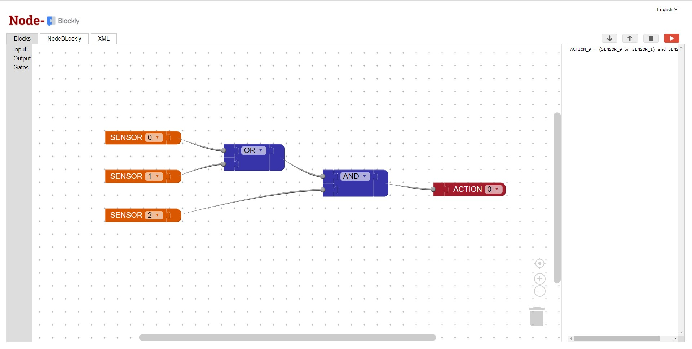

To run the Blockly UI application please open NodeBlockly/index.html

NodeBlockly demo generates code like blockly without connection blocks,

These folders hold the nesseseary code for the page visulation.

"blockly" folder holds the code behind Blockly itself.

Original Blockly from
https://github.com/google/blockly

Matìj Suchánek
jsem@matejsuchanek.cz